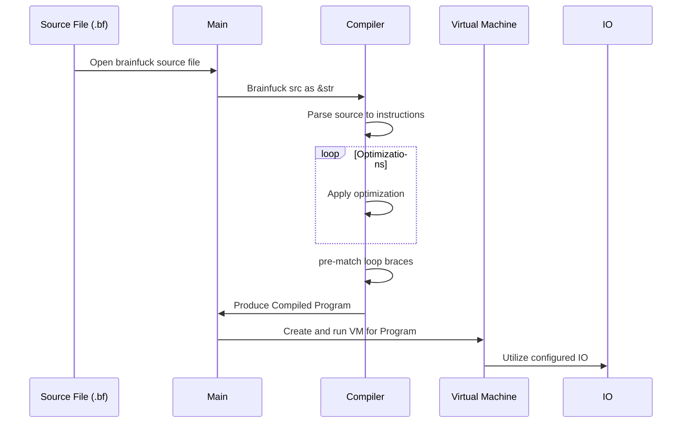

# Brainfrick-rs
An optimizing brainfuck interpreter written in Rust.

# Learn More
Check out my blog for an in-depth look at how brainfrick-rs works:


https://rafibayer.github.io/2022/11/02/brainfrick.html

# Optimizations
- Contraction
    - Fuse repeated `>`/`<` and `+`/`-` instructions
- No-Op
    - Skip No-Op instructions at compile-time
- Clear
    - Replace `[-]` with an internal `Clear` instruction
- Copy Loop
    - Replace certain copy/multiply operations with optimized instructions

## Impact
`samples/mandelbrot.bf` runtimes

Unoptimized:
```
$ time cargo run --release -- samples/mandelbrot.bf
...
real    0m18.641s
user    0m0.000s
sys     0m0.015s
```

Fully Optimized:
```
$ time cargo run --release -- samples/mandelbrot.bf
...
real    0m5.276s
user    0m0.000s
sys     0m0.015s
```

# Architecture
