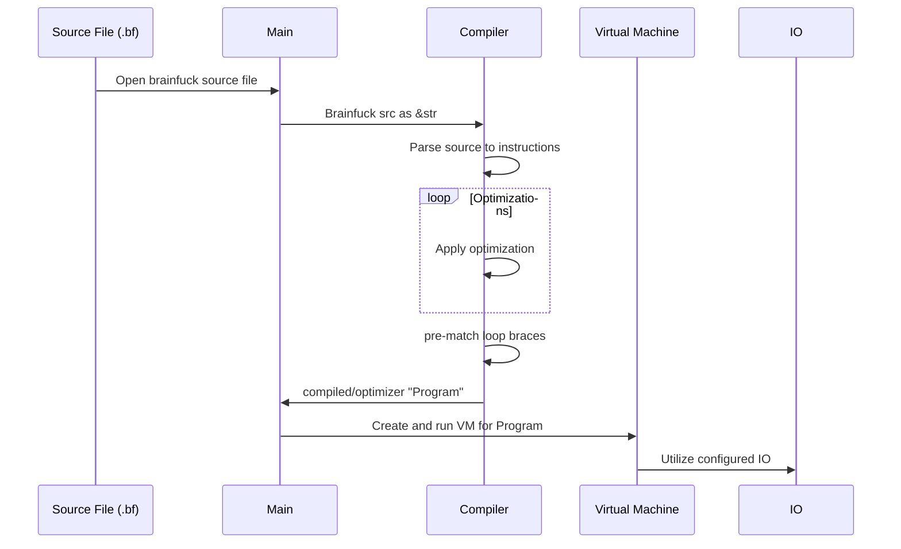

# Brainfrick-rs
An optimizing brainfuck interpreter written in Rust.

# Architecture

```mermaid
sequenceDiagram
    participant src as Source File (.bf)
    participant main as Main
    participant compiler as Compiler
    participant vm as Virtual Machine
    participant io as IO
    src->>main:Open brainfuck source file
    main->>compiler:Brainfuck src as &str
    compiler->>compiler: Parse source to instructions
    loop Optimizations
        compiler->>compiler: Apply optimization
    end
    compiler->>compiler: pre-match loop braces
    compiler->>main: compiled/optimizer "Program"
    main->>vm: Create and run VM for Program
    vm->>io: Utilize configured IO
```